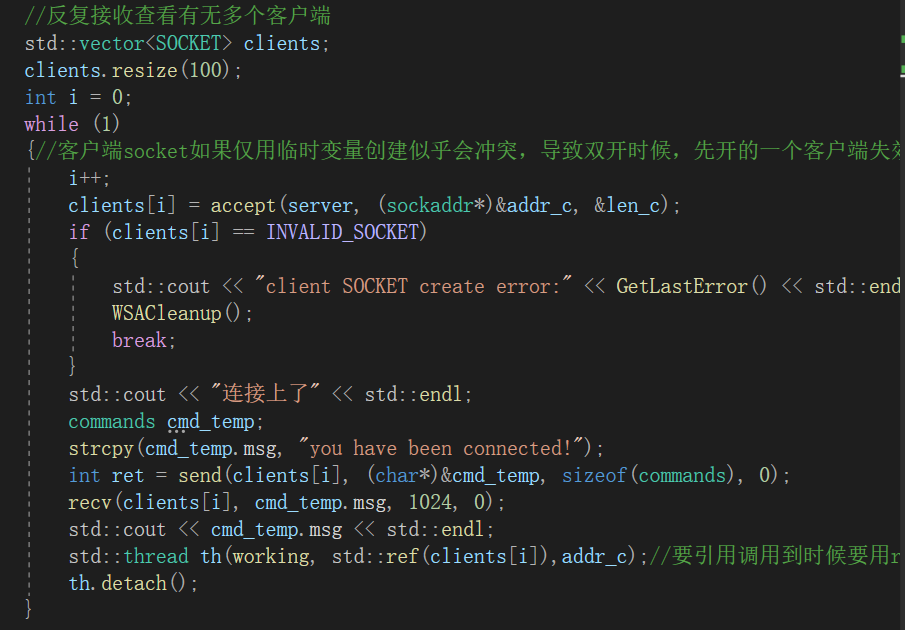
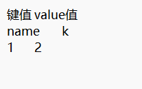
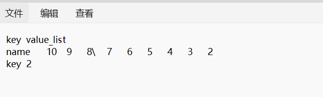
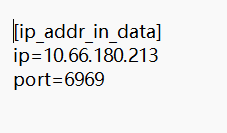

# 目录 
- 项目介绍
- 使用语言，特性
- 完成的功能兼食用指南
- 其他

# 项目介绍 
使用socket和多线程实现远程操作本地数据
___
# 使用语言，特性 
语言：C/C++
特性：类，Socket，多线程，STL，文件操作，字符串处理
___
# 完成的功能 
1. 使用了**socket编程**，使得能够通过网络使得客户端与服务端建立联系进行交互。（**至少局域网内是测试过可行的**，端口映射准备尝试一下，公网ip不清楚没测过） 
2. 使用了**多线程**，使得一个服务端能对多个客户端进行响应。（最大应该能支持100个，只要服务端不退出就能持续运行）
同时在操作数据的时候也注意了资源争夺的问题，使用了智能的**互斥锁** 

3. 实现指令：
## 字符串类型 
- set [key] [value] 存储 key-value 类型数据
- get [key]   获取 key 对应的 value
- del [key] 删除 key 对应的 value
## 双向链表类型 
- lpush [key] [value] 可直接放一个数据在左端
- rpush [key] [value] 可直接放一个数据在右端
- range [key] [start] [end] 将key 对应 start 到 - end 位置的数据全部返回
- len  [key] 获取 key 存储数据的个数
- lpop [key] 获取key最左端的数据并删除
- rpop [key] 获取key最右端的数据并删除
- ldel [key] 删除key 所有的数据
## 其他指令（这里需要注意有一点不同） 
（稍微偷懒了一下help是本地响应，为了确保send和recv对等help指令发送的是ping，因而会返回pong）
- ping 心跳指令，ping响应pong
- help 0 获取所有command指令的使用方式
- help [command] 获取单个command指令适用方式
___
4. 实现了**数据的持久化**
**都用的是txt的存储，放在server的根目录下**
(即/新建文件夹/server/)

**hash.txt是字符串类型的存储** 

**hash_list.txt是双向链表类型的存储** 

 
5. 使用了**配置文件存储了监听端口和ip**，在代码内部是使用了**minIni.h库**进行读取操作
内容存储于server和client文件夹内的**s_ip_port.ini和c_ip_port.ini**
### 比较重要的
**运行的时候需要注意更改客户端的ip配置文件的ip为本机ip或者服务器ip(可以通过cmd的ipconfig查看，或者如果有公网ip知道自己的公网ip也可以输入公网ip），每个机子不一定会一样，如果没改就连不上**)
**port（端口）确保两边是一样的**就行。

 
6. 在**客户端输入之后清空了输入缓冲区**，防止一次性输入太多导致的bug.
___
# 其他
1. 可能还有其他bug没测出来的
